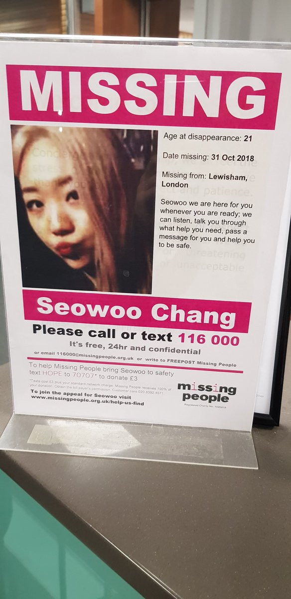
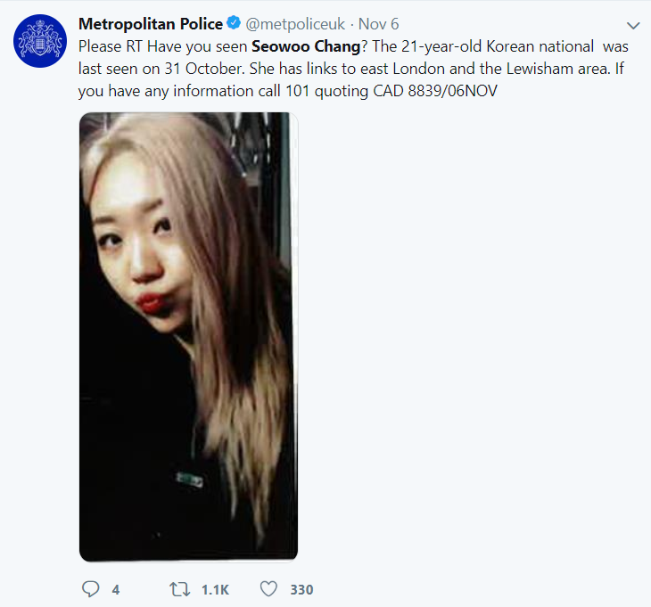
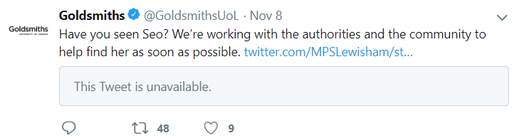

<html><head><meta content="text/html; charset=UTF-8" http-equiv="content-type"></head><body class="c9"><h1 class="c16">Using open source intelligence to search for a missing person, the case of missing student Seowoo Chang. </h1>
  

If open source intelligence can be used to solve international crimes at the highest level then it can surely be used to find missing people. However, what I have learnt painfully is that in any case of a missing person you must act within 48 hours. After 48 hours, the trail will grow cold, conflicting information builds up and both digital information and human memory will degrade or be lost completely.

It was only after reading week (12/11/2018) that I first heard that there was a student, her name Seowoo Chang (also known as jenny/jennifer) had gone missing. The fact that the missing poster was placed very frequently all over campus, suggested to me that this was serous. Me and my friends were curious and we searched on the google and twitter, what we discovered really concerned us. 

There were three points that caused serious concern that led me to take action and actually start a search:

<ol class="c4 lst-kix_793qqeh6yjby-0 start" start="1"><li class="c3 c5">The last known sighting in deptford bridge (02/11/2018), Seowoo was wearing adidas slider sandals, the average temperature on that day was 6 degrees celsius (darksky.net), you also cannot walk far while wearing slider sandals.</li><li class="c3 c5">She did not take her phone with her, all her possessions are still in the room. I assume when they mean by possessions they also include any travel cards, bank cards etc..</li><li class="c3 c5">She is an international student, her only source of income would be from her parents (visa restrictions as well) </li></ol>

From these three points it is obvious to anyone that she is vulnerable and the situation is life threatening. Yet, Goldsmiths university was merely relying on the metropolitan police to find her which I believe was naive and was not enough. 

Why Lewisham police/Metropolitan police should not be expected to carry out an extensive search ?

<ul class="c4 lst-kix_336sd33g2vb9-0 start"><li class="c3 c5">Massive cuts to the Metropolitan police budget:</li></ul>
<a class="c1" href="https://www.google.com/url?q=https://www.theguardian.com/uk-news/2018/may/18/metropolitan-police-cressida-dick-budget-cuts-violent-crime-rise-london&amp;sa=D&amp;ust=1554249475595000">https://www.theguardian.com/uk-news/2018/may/18/metropolitan-police-cressida-dick-budget-cuts-violent-crime-rise-london</a>&nbsp;&ldquo;The Met has lost &pound;600m in funding since 2011.&rdquo;

<a class="c1" href="https://www.google.com/url?q=https://www.lewishamlibdems.org.uk/police_cuts&amp;sa=D&amp;ust=1554249475596000">https://www.lewishamlibdems.org.uk/police_cuts</a>&nbsp;- some of the cuts

<ul class="c4 lst-kix_xfu8h4ihtpib-0 start"><li class="c3 c5">Increasingly violent crimes, the usual crimes such as burglary, robbery are now more violent, just look at any online local lewisham (or any london) news outlet.</li></ul>
<a class="c1" href="https://www.google.com/url?q=https://www.theguardian.com/society/2016/apr/10/tough-streets-myron-yarde&amp;sa=D&amp;ust=1554249475597000">https://www.theguardian.com/society/2016/apr/10/tough-streets-myron-yarde</a>&nbsp;article is from 2016, but it paints a well-known picture of the area. It is clear the lewisham and metropolitan police will be overwhelmed with the increasing number of violent crimes.

<ul class="c4 lst-kix_x9bblymcfagm-0 start"><li class="c3 c5">Regular occurance of missing people in lewisham, police could have become fatigued and desensitised.</li></ul>

<ul class="c4 lst-kix_254it4fiqxtv-0 start"><li class="c3 c5">Lewisham is in in a city, highly populated, urban, not a village community, searching for a missing person will use a large amount of police resources. </li></ul>

<ul class="c4 lst-kix_254it4fiqxtv-0"><li class="c3 c5">Lewisham police department are not prioritising missing people, as shown in a deleted tweet. Even though this was one tweet, it shows the possible current state of the staff that work in the lewisham police department. </li></ul>
<a class="c1" href="https://www.google.com/url?q=https://www.standard.co.uk/news/crime/fury-over-police-tweet-saying-officers-were-too-busy-to-fight-crime-a3623526.html&amp;sa=D&amp;ust=1554249475599000">https://www.standard.co.uk/news/crime/fury-over-police-tweet-saying-officers-were-too-busy-to-fight-crime-a3623526.html</a>&nbsp;

With this information, it was clear that you could not solely rely on the police, this is when I begun to carry out my own search, I was aiming at narrowing the search space which I hoped would speed up any existing search. I had to make a lot of assumptions with a limited amount of information.

Search Log: pre-search information (14/11/2018) to create a profile of a missing person

<ul class="c4 lst-kix_aiijtwcirb0q-0 start"><li class="c3 c5">Seowoo Chang was officially reported missing on 31/10/2018 which was halloween.</li></ul>

<ul class="c4 lst-kix_aiijtwcirb0q-0"><li class="c3 c5">Last reported sighting is Deptford bridge area 02/11/2018, unknown time but from the detailed description it&#39;s more likely it was during daylight &ldquo;white baseball cap with </li></ul>
&ldquo;YANKS&rdquo; logo&rdquo; suggests that the sighting was in some artificial light or during daylight.
<ul class="c4 lst-kix_5oeoo38s13bs-0 start"><li class="c3 c5">She lived in student accommodation in New cross, was of age 21 and a 3rd Year BA Fine Art &amp; History of Art. An international student, most likely all income was relied on by family in South Korea. Closest online friend, sebby - <a class="c1" href="https://www.google.com/url?q=https://twitter.com/h0tmez&amp;sa=D&amp;ust=1554249475602000">h0tmez</a>. Seowoo has no online presence, no social media (used social-searcher.com), no records even though she was a 3rd year art student.</li><li class="c3 c5">This missing poster picture of Seowoo is a group photo, by the fact that it is cropped. It must have been supplied by her friends, when they reported to the police. As you see, the image was taken from a computer screen, most likely a macbook air (you can see the edge of the macbook screen in the photo), most of the images look like they were taken on holiday.</li></ul>

<ul class="c4 lst-kix_aiijtwcirb0q-0"><li class="c3 c5">She was wearing a Black Puffer styled jacket, white baseball cap with &ldquo;YANKS&rdquo; logo and adidas style slipper sandals. - from the detailed description, I assume the sighting was from a CCTV camera (police detectives who need to gain CCTV footage would normally go to the place and request footage and copy with a USB on site).</li><li class="c3 c5">With adidas slipper sandals, you can not walk for long distances.</li><li class="c3 c5">48 hour gap between reported missing to last sighting.</li><li class="c3 c5">Its only at the end of the investigation (16/11/2018) that I realise the sighting was not from a camera and may be error-prone. If the police had a sighting from a CCTV camera then that snapshot image would be shown in any tweets or missing posters as is the usual case with missing people. The police would also have to search 48 hours of footage from many different cameras to find her, which is very unlikely. At the start of the search, I operated on the assumption that a TFL traffic camera (which faces east) on the Deptford bridge DLR station is where the sighting came from. </li><li class="c3 c5">She did not take her phone with her, all her possessions are in her room as her friends stated on twitter, (her room door must also have been unlocked). I assume she did not take her bank card nor any travelcard. - &ldquo;all her stuff is in her room. Even her phone is there&rdquo; <a class="c1" href="https://www.google.com/url?q=https://www.weekender.co.uk/articles/news-and-sport/missing-seowoo-chang-deptford-lewisham/&amp;sa=D&amp;ust=1554249475605000">https://www.weekender.co.uk/articles/news-and-sport/missing-seowoo-chang-deptford-lewisham/</a>&nbsp;</li><li class="c3 c5">From deptford bridge the DLR line only travels to Canary Wharf or to Lewisham. </li></ul>

Search log: main search, focus on areas of interest in last known sighting.

Used Google My Maps this can be shared with other searchers including any police or emergency services. Viewable on mobile, other searchers can also add images to the interactive map too. With google My Maps you can also import data and export map data. I did this after the search, I should have done this during the search.

<h3 class="c3">Full Search log: <a class="c1" href="https://www.google.com/url?q=https://drive.google.com/open?id%3D1QXw5POmsq1vHouwavLM0LDUiRWt_dZbi%26usp%3Dsharing&amp;sa=D&amp;ust=1554249475608000">https://drive.google.com/open?id=1QXw5POmsq1vHouwavLM0LDUiRWt_dZbi&amp;usp=sharing</a></h3>

<h3 class="c3">Conclusion</h3>

The search ended after finding out what happened to Seowoo on 16/11/2018 at 19:50. It was clear that during the search, the trail was gone, I had exhausted all possible search areas. 

<a class="c1" href="https://www.google.com/url?q=http://news.met.police.uk/news/missing-lewisham-student-found-deceased-the-death-is-not-being-treated-as-suspicious-333005&amp;sa=D&amp;ust=1554249475610000">http://news.met.police.uk/news/missing-lewisham-student-found-deceased-the-death-is-not-being-treated-as-suspicious-333005</a>&nbsp;- final verdict by metroploitan police

Goldsmiths university only emailed the art department students, I did not receive any email about a missing student. Even the email about Seowoo chang was sent too late (11/11/2018)

Goldsmiths university even spelt her name incorrectly.

Had we known earlier, I believe the outcome would have been different. There was only one tweet sent by Goldsmiths University and the Student union, in a missing person case the reminders need to be continuous, no search party was formed. 

There is now a petition:

<a class="c1" href="https://www.google.com/url?q=https://www.change.org/p/met-police-justice-for-seo-woo-chang&amp;sa=D&amp;ust=1554249475613000">https://www.change.org/p/met-police-justice-for-seo-woo-chang</a>

Missing person posters would only work effectively in small rural areas, in communities and small towns where there is less anonymity. In an a highly populated urban area you can only rely on open source intelligence. The majority of people cannot remember a person&#39;s face from memory.

To conclude, I did not have access to additional information that would be available to police or family/friends, yet using open source intelligence I was able to cover a large search space and rule out possible locations. In any missing person case it is essential that you do not solely rely on the police and that you use open source intelligence to search within 48 hours of person going missing. 

</body></html>
